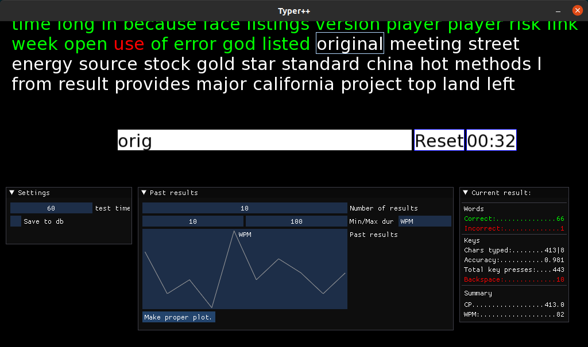

# SpeedTyper

This is a small project for fun.

It runs a classic writing speed test. You set the time of the test, random words appear, you type as many of them as possible. Results are stored and various values can be plotted.



I wanted to improve some skills and try a few packages, like
* rendering GUI application with event loop using SFML and DearImGui,
* running multiple threads and synchronize them,
* query SQL from C++ with sqlpp11, connected to SQLite3,
* plotting with Matplot++,
* testing with Catch2,
* using other libraries: fmt, gsl, ...,
* using CMake for generating makefiles and Conan to handle dependencies,
* some goodies of newer C++ standards (compiled for C++20),
while creating something fun and a little bit useful. I use this program almost daily. Some parts might be written in a slightly more complicated way, that's a feature.


## Compile and run.
Needed:
* CMake 3.16
* Conan (used with 1.28.1)
* GCC >= 9.3., Clang >= 10 will do

```
mkdir build
cd build
cmake ../
make
```

`cmake` will handle conan.

